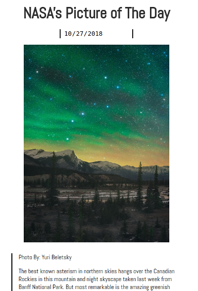

# Simple NASA API
Enable your user to enter a date and return the picture/video of the day from NASA's API

**Link to project:** https://stoic-saha-8850a5.netlify.com

## How It's Made:

**Tech used:** HTML5, CSS3, JavaScript, NASA's API
Styling for this project was done using CSS Grid & Flexbox. Written in vanilla Javascript using the fetch method to access an API.

## Lessons Learned:
Learned how to use a fetch command to access NASA's APOD API and use that data to retrieve the picture of the day for any given day. Also called different properties in a JSON file looped though the different objects in the JSON file.

## Examples:

**OOP Calculator:** https://github.com/Eriquette/week01-alumni-project-calculator/tree/answer

**Weather API** https://github.com/ericamendez/weather-api-bootcamp2018c-week07/tree/answer

**Daily Code Challenges:** https://github.com/Eriquette/Daily-Code-Challenges
